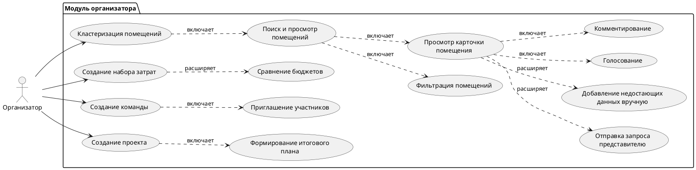
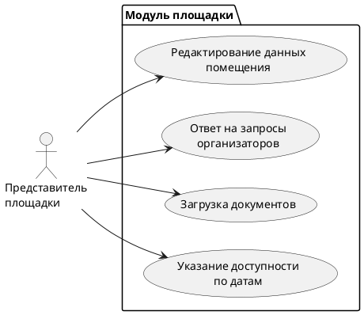

# 1. Перечень заинтересованных лиц 

## Организаторы мероприятий и их команды
**Описание:** Основные пользователи системы. Им необходимо удобное средство для поиска подходящих помещений, сравнения вариантов по стоимости, возможность работы в команде для совместного выбора лучшего решения. Члены рабочих групп, которые совместно анализируют варианты площадок, голосуют, обсуждают и оставляют комментарии. Им важна прозрачность процесса выбора и удобные инструменты коллективной работы.

## Представители площадок (дома культуры, муниципальные учреждения, частные площадки)
**Описание:** Поставщики информации о помещениях. Им важно иметь удобный интерфейс для обновления данных, принятия запросов от организаторов и повышения востребованности своих площадок.

# 2. Перечень функциональных требований

## Модуль для организаторов мероприятий

### 1. Поиск и подбор помещений
1. Организатор должен иметь возможность просматривать каталог помещений, доступных для аренды.
2. Возможность фильтрации по параметрам:
   * вместимость;
   * тип помещения;
   * стоимость аренды;
   * наличие оборудования;
   * доступность в нужные даты.
3. Возможность просмотра карточки помещения:
   * описание;
   * фотографии;
   * контактные данные;
   * известные ограничения;
   * текущая доступность.

### 2. Сбор и уточнение информации о помещениях
1. Возможность отправлять запросы представителям площадки для уточнения данных.
2. Возможность добавлять вручную недостающие данные (например, после телефонного звонка).
3. Возможность прикладывать файлы (фото схемы зала, прайс-листы).

### 3. Кластеризация и группировка помещений
1. Автоматическая группировка помещений по типу, размеру, назначению или другим доступным данным.
2. Возможность ручного объединения помещений в группы (например, "бюджетные варианты", "расположение в центре").
3. Возможность сохранять результаты кластеризации для последующего использования.

### 4. Формирование и сравнение бюджетов
1. Возможность создавать наборы затрат:
   * аренда помещения;
   * техника;
   * персонал;
   * декор;
   * логистика.
2. Возможность копировать и редактировать наборы затрат.
3. Возможность сравнивать два и более вариантов бюджета по сумме и структуре расходов.

### 5. Работа с командами
1. Возможность создавать команды пользователей.
2. Возможность приглашать участников в команду по ссылке или email.
3. Возможность назначать роли (лидер, участник).
4. Возможность совместного просмотра вариантов помещений.
5. Возможность оставлять комментарии и оценки.

### 6. Групповое голосование и обсуждение
1. Возможность голосовать за помещение ("нравится", "не подходит").
2. Просмотр агрегированных результатов голосования.
3. Возможность вести обсуждение внутри карточки помещения.

### 7. Управление проектом мероприятия
1. Возможность создавать проект мероприятия.
2. Добавление помещений в проект.
3. Формирование итогового плана (выбранная площадка + финальный бюджет).
4. Возможность экспортировать итоговый план в PDF.

## Модуль для представителей площадок
1. Возможность редактировать данные своей площадки.
2. Возможность отвечать на запросы организаторов.
3. Возможность указывать доступность по датам.
4. Возможность загружать документы (прайс-лист, правила аренды, схема зала).

## Сервер
1. Реализует механизм обновления и выдачи данных по помещениям и проектам.
2. Обеспечивает хранение данных о бюджетах, командах, проектах.
3. Обеспечивает механизм уведомлений (ответы от площадок, новые комментарии).
4. Гарантирует корректное разделение прав доступа.

# 3. Диаграммы вариантов использования

# 4. Перечень сделанных предположений

## Технические предположения
1. **Информация о государственных помещениях доступна частично, поэтому система должна поддерживать неполные карточки.**
2. **Сервер предполагается web-ориентированным с REST API.**
3. **Все данные о бюджетах и проектах хранятся централизованно.**

## Бизнес-предположения
1. **Представители государственных учреждений готовы обновлять данные площадок через систему.**
2. **Организаторы мероприятий работают в небольших и средних командах (до 20 человек).**
3. **Система используется преимущественно для молодёжных, образовательных и культурных мероприятий.**
4. **Пользователи системы знакомы с базовой логикой командной работы (общие проекты, голосования).**

---

# 5. Перечень нефункциональных требований

## Безопасность
1. **Разграничение прав доступа для разных типов пользователей.**
2. **Шифрование персональных данных и документов, загруженных представителями площадок.**
3. **Использование современных механизмов аутентификации.**

## Надёжность
1. **Все проекты и бюджеты должны сохраняться автоматически.**
2. **Данные не должны теряться при обрыве соединения.**
3. **Сервер должен обеспечивать стабильную работу при больших объёмах данных о помещениях.**

## Удобство использования
1. **Интерфейс должен быть интуитивно понятным, особенно для командной работы.**
2. **Поддержка удобного просмотра карточек помещений и комплексного сравнения вариантов.**
3. **Минимальное количество действий для голосования и обсуждения.**

## Производительность
1. **Поиск и фильтрация помещений должны выполняться не дольше 3 секунд.**
2. **Система должна масштабироваться при увеличении количества площадок.**

## Расширяемость
1. **Архитектура должна позволять добавление новых модулей (например, поставщики услуг, календарь мероприятий).**
